  <!-- LinkedIn -->
  

  <!-- CV -->
  
  
  <!-- Profile views -->
  

<h1 align="center">hey there 👋</h1>

- 👨‍💻 I'm **Dekel** - Computer Science graduate & Software Developer.  
- 🔭 I’m currently working on a **course platform** project using .NET microservices.
- 📬 Reach me on **[LinkedIn](https://www.linkedin.com/in/dekel-rafian-software-developer/)**  
- 📄 Check my **[CV](https://raw.githubusercontent.com/dekel5030/dekel5030/main/Dekel-Rafian-CV.pdf)**  

## ⚙️ Tech Stack

<table>
  <tr>
    <td align="center">
      <b>Languages</b>  
      
    </td>
    <td align="center">
      <b>Frameworks & Libraries</b>  
      
    </td>
    <td align="center">
      <b>Databases & Messaging</b>  
      
    </td>
    <td align="center">
      <b>Cloud & DevOps</b>  
      
    </td>
  </tr>
</table>

---

## 🔥 My Stats

 
  
   

---

## 🐍 Snake – Contributions

  

